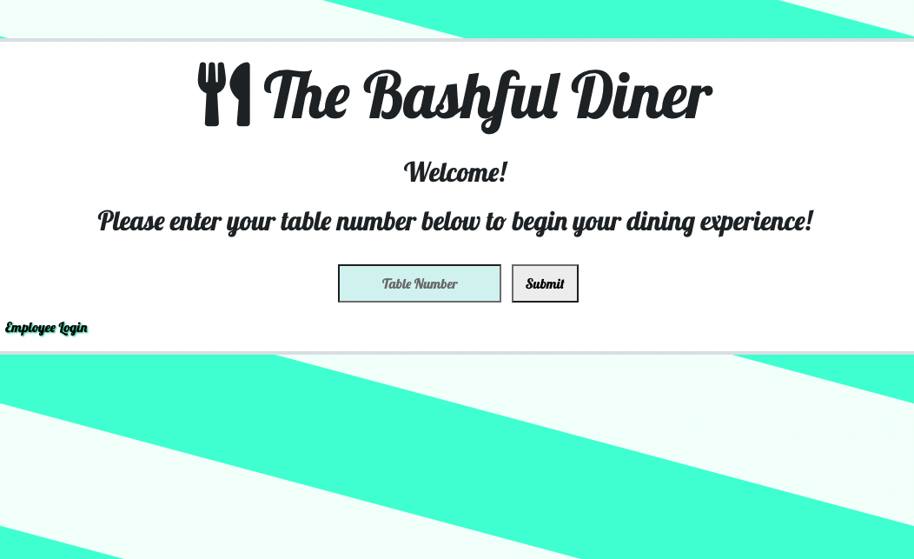
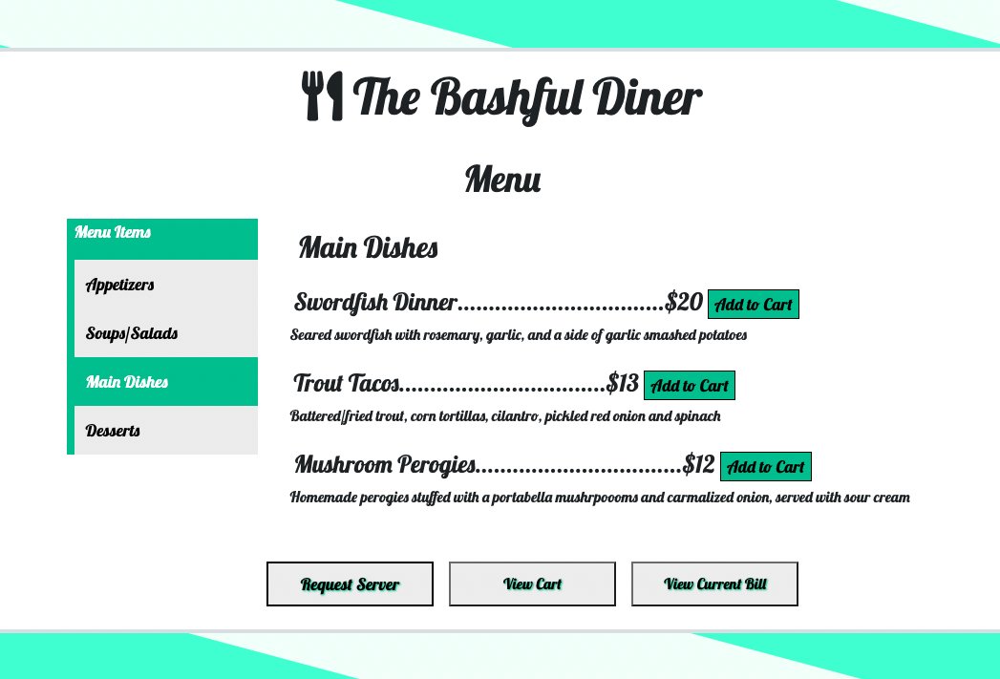
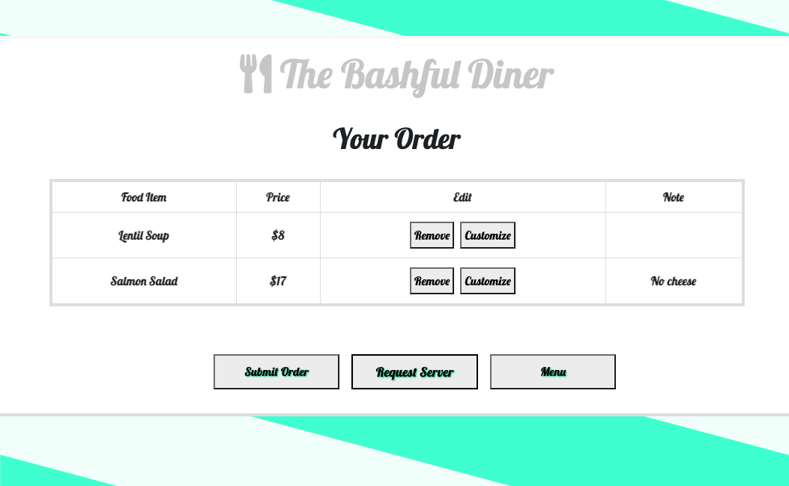
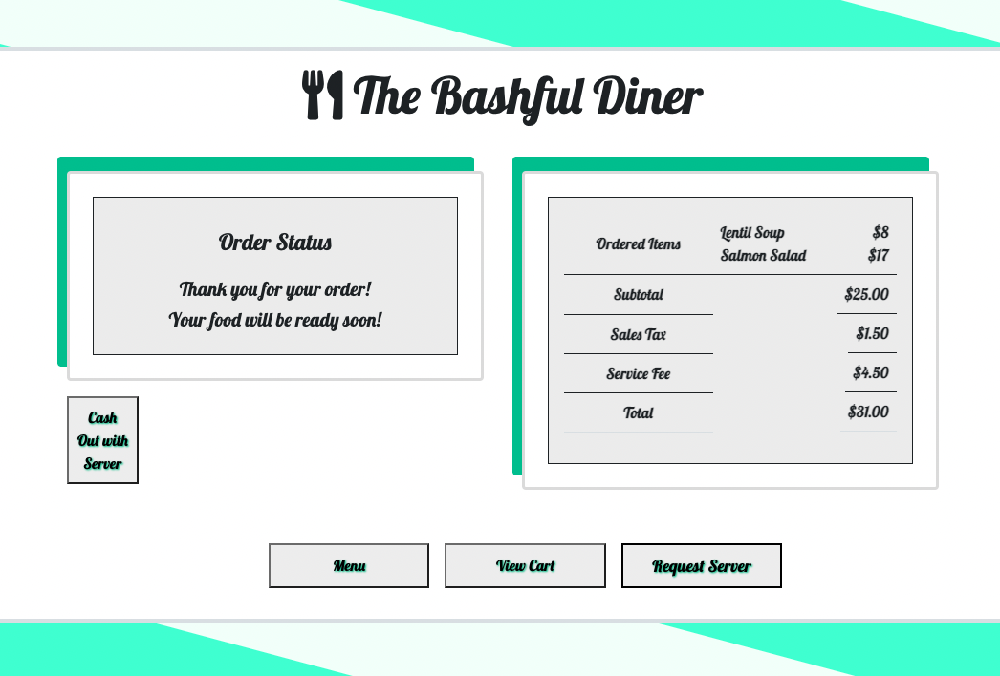
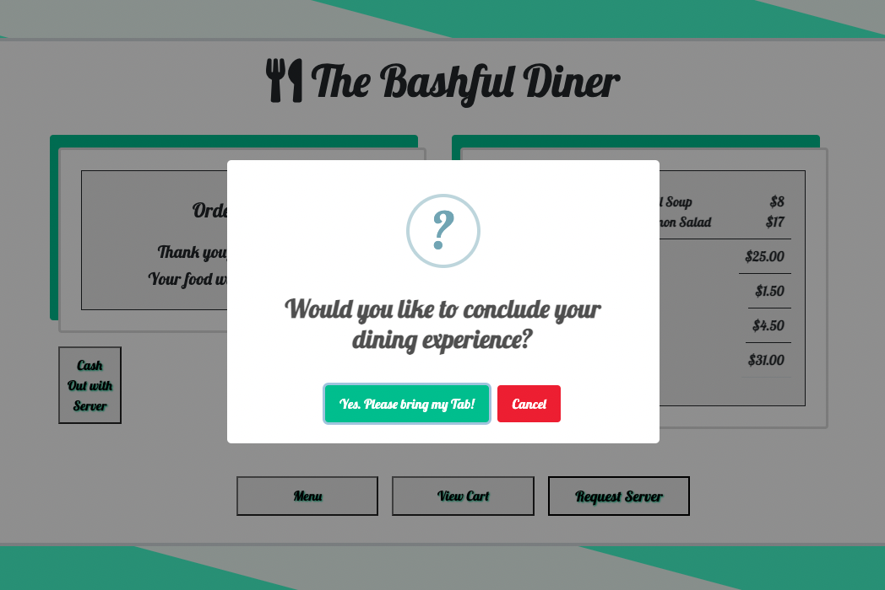
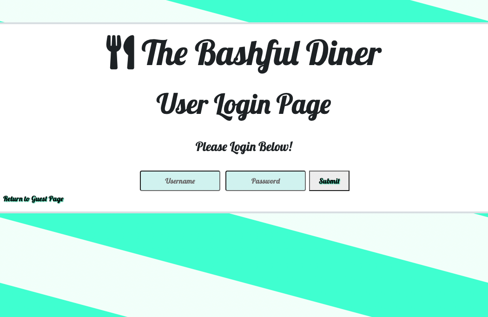
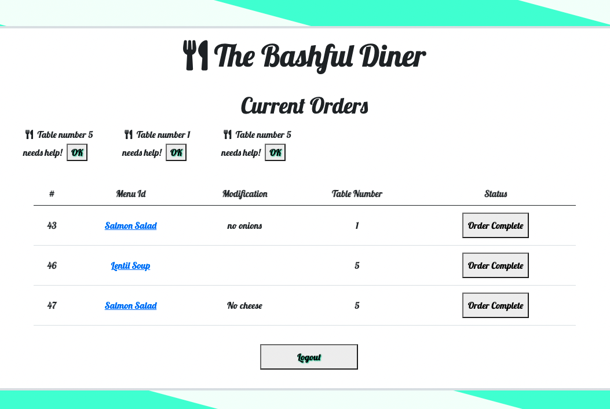

# The Bashful Diner

## Description
The Bashful Diner will automate everything involved with ordering at a restaurant in order to make the process simple and streamlined, for both guests and restaurant staff. Our app offers all users a dining experience that aims to reduce the stress of any awkwardness or miscommunications that go hand-in-hand with service-based social interactions. Restaurant guests will be more in control of and feel more comfortable about their time out in public than ever before, and restaurant staff will receive clear and concise communication with customers in order to ensure efficiency and maximum satisfaction for all parties.

Guest Side
* When the guest arrives at a given restuarant, they will start on the landing page of the app which will ask for their assigned table number
* Once logged in, the guest is directed to the full menu
* When the guest selects a menu item, it is added to their order shopping cart. Guests may order multiple items from the menu.
* The guest can input special requests in order to customize their meal
* The guest may then submit the order items in their shopping cart and the items will leave the shopping cart and appear on the bill page.
* The bill page will show all submitted order items and the current bill, which includes all items, a subtotal, added tax, service fee, and total cost.
* On every page, the guest will be able to click a button which will notify waitstaff to be called to their table to answer any questions or fulfill any atypical requests 
* When the guest has finished their meal, they will be able to view the bill and request to cash out

Server Side
* When a server arrives at work, they will start on the landing page of the app and can click the "employee login" button at the bottom of the page
* They will be able to login to the app using a username and password
* They are then directed to a control page where all open orders submitted by current restaurant guests are posted so that the server may see what orders still need to be fulfilled
* All orders on the control page will show which table # it was ordered by, the food item name, and any customization/modification notes made by the guest
* Once an order is fulfilled, the server will click the order complete button to remove it from the open orders page
* Notifications made by tables to request a server for assistance will pop up at the top of the control page
* When finished, the server can click the logout button at the bottom of the page which will return them to the landing page

## Deployed Application

[The Bashful Diner](http://www.thebashfuldiner.com/)

## Table of Contents
- [Technology Utilized](#technology-utilized)
- [Future Development](#future-development)
- [Collaborators](#collaborators)
- [Questions](#questions)

## Technology Utilized
Sequelize, Express, Node.js, MySQL, Bootstrap, Handlebars, Animate CSS, and Sweet Alert 2

## Future Development
In the future we'd love to see our vision grow to include many exciting and helpful features including:
* The addition of more language options
* Reservation creation prior to guest arrival 
* User reviews of service/restaurant experience
* Guest login creation which would hold saved data of previous dining experiences/orders
* In-app payment handling
* An order progress status bar which will update in real time
* A map function showing all restaurants that use the Bashful Diner within a specific area 
* A search function on the menu that would allow users to sort dishes based on dietary restrictions and preferences

## Collaborators
**Lauren Wenzel**
- [Github](https://github.com/Laurenzel93)
- [Email](lwenzelwebdev@gmail.com)
- [Portfolio](https://laurenzel93.github.io/my-portfolio/)

**Kelly Johnson**
- [Github](https://github.com/KellyJohnson364)
- [Email](KJ3641402@gmail.com)
- [Portfolio](https://kellyjohnson364.github.io/knj-portfolio-page/)

**Cory Rapala**
- [Github](https://github.com/crudd03)
- [Email](coreyrapala@gmail.com)
- [Portfolio](https://crudd03.github.io/my-portfolio/)

**Alissa Garzoni**
- [Github](https://github.com/RevyWatson)
- [Email](agarzoni.282@gmail.com)
- [Portfolio](https://revywatson.github.io/rebooted-portfolio/)

## Questions
Have questions or comments about this application?
Please feel free to email us at: bashfuldiner@gmail.com
